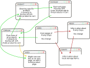

# What I want to do in this project

Before starting this, I wanted to test out three things. Using JSDoc in a project, unit-test/TDD all JavaScript-code and making a single-page-application (SPA).

Before starting this I have tested all three separate from each other, and it is evident that JSDoc is going to be the easiest part of this. The reason why I say unit-test/TDD and not just unit-testing or just TDD is that I want to do test-driven-development, but my skills are not there yet. It is especially difficult to test DOM interaction such as function that only does `document.createElement("")`.

A year and a half ago I made a simple SPA chat-page with login and connection to the chatgpt api (both backend and frontend). In this project I plan to reuse this SPA-code. I do not plan to make the whole rany-days webpage single-page, a store want themselvse and their customers to be able to link spesific products, so some of the pages have to use their own url. The payment-page is the most logical place to "inject" som spa-fun. This is a page with three pages inside of itself, and the most important part of the SPA-code I had popstate handled. This enables a user to go back to the previous page using the browsers own forward and backgwards buttons.

In the HTML/CSS version I made, the payment was three pages in one html-file, so this light-weight version of SPA I plan will improve the user experience a lot. 

- [ ] Using JSDoc in all JavaScript code
- [ ] All code unit-tested
- [ ] Payment is an SPA

# What I have to do in this project
Renew my rany-days webpage - using the provided api at https://v2.api.noroff.dev/rainy-days. In this api we also see the addition of discounts on the price and the ability to favourite a product. I interpret the favourite ability like adding a clickable heart and a separate page or viewing for all the favourites.

My page will use local storage (cookies), so I should add a page about this as well. This is not required, as all the usage is necessary for the project - therefore required.

- [ ] Renew Rainy Days
- [ ] Header/Footer their own JS classes
- [ ] Connect to API for content
- [ ] Connect to API for product
- [ ] Ensure all API-data (like discounts) are used to add more value to the user experience.
# Page layout

# Reflections
Started unit testing, and found a bunch of hidden issues with my code. Still considering unit testing an awfull activity that nobody should be subjected to, but is starting to se value in it, and is almost looking forward to TDD. This also negates the need to have a second screen to see my progress, jest tell me if something is added to HTML correctly as expected or not. I can finally program from my bed 100% of the time.